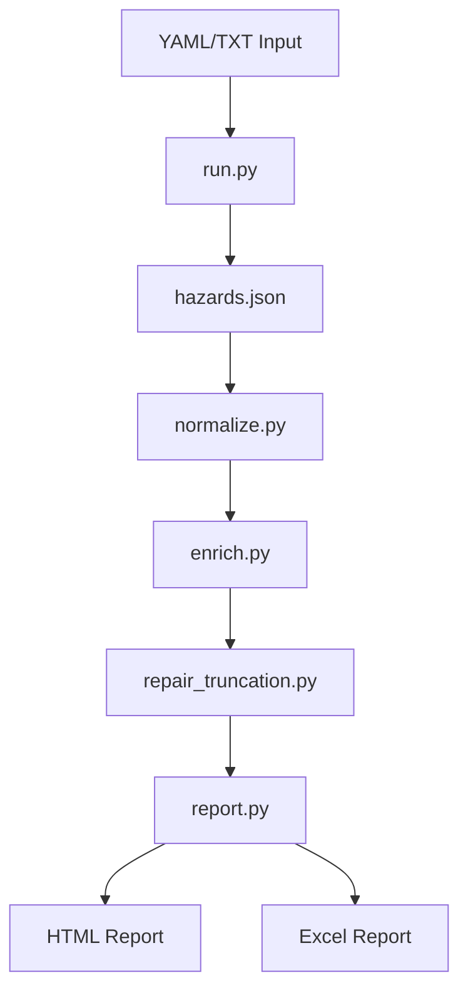

# Architecture

## Data Flow

Synthetic Danger operates as a pipeline of Python scripts that process hazard data sequentially:

## Key Components

- **Hazard Generation**: Uses Prompt Engineering to identify candidates based on industry-standard categories (e.g., Mechanical, Electrical).
- **Normalization**: Uses LLM clustering to group similar entities, reducing redundancy.
- **Enrichment**: Generates specific safety requirements and verification methods for each hazard.
- **Repair**: A post-processing step that identifies and fixes JSON truncation issues from LLM responses.
